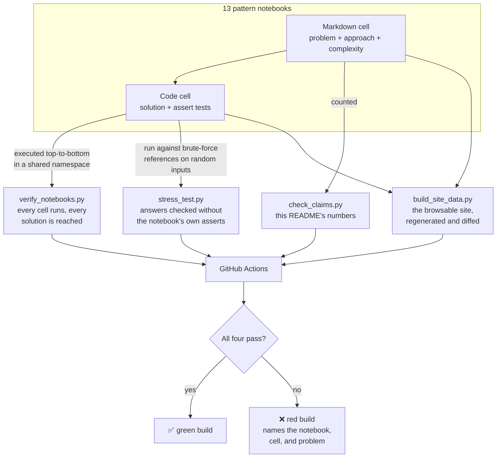

# Core Algorithms for LeetCode

**A pattern-first coding-interview prep bank: 13 algorithm patterns, 90 worked problems each, every solution paired with runnable `assert` tests, a sample of them cross-checked against independent references, and the whole thing enforced green by CI.**

Built by Shivani Bokka.

**Browse it: <https://pattern-bank-liart.vercel.app>**

[](https://github.com/shiva-shivanibokka/Core-algorithms-for-Leetcode/actions/workflows/verify.yml)
[](LICENSE)
[](https://www.python.org/)

---

### Recruiter TL;DR

- **What it is** — a self-built coding-interview study bank organized by *pattern* (Two Pointers, Sliding Window, DP, …) rather than by random problem: 1,170 problem slots, 1,130 distinct problems, 655 distinct LeetCode numbers cited, all worked and all runnable.
- **Hardest problem solved** — making the bank *trustworthy*, which turned out to be a harder claim than it sounds. Inline asserts prove a solution matches the tests written beside it — by the same person, at the same sitting, from the same reading of the problem. That is circular, and three ways of being wrong survive it. All three are now checked by scripts that run in CI, and each one had already caught something real.
- **Impact** — 13 patterns × 90 problems, difficulty-tiered, **every cell green under CI on every push**, plus 66 problems sampled and re-verified against brute-force references that share no code with the solutions, covering every one of the 13 patterns. All of it is [browsable](https://pattern-bank-liart.vercel.app) — pick a pattern, pick a problem, and the solution is written out a line at a time with the reasoning first and the evidence after.

---

## Overview

Most interview prep is a pile of unrelated solved problems. This repo is organized the way the problems are actually *tested* — by the underlying pattern. Learn the shape of "Two Pointers" once, then drill 90 variations of it, from a warm-up Easy through a Hard that a FAANG onsite would use.

Each of the 13 notebooks is a self-contained lesson: a short explanation of the pattern, then a graded ladder of problems. Every problem states the approach and its time/space complexity, followed by a clean solution and `assert`-based tests.

**Who it's for:** primarily my own interview preparation, and anyone who wants a pattern-organized, *verified* problem bank to study from rather than trusting unverified snippets off the internet.

## What's inside

The 13 patterns, in the intended learning order:

| # | Pattern | # | Pattern |
|---|---------|---|---------|
| 01 | Two Pointers | 08 | Binary Tree BFS |
| 02 | Sliding Window | 09 | Graph DFS / BFS |
| 03 | Fast & Slow Pointers | 10 | Topological Sort |
| 04 | Binary Search | 11 | Top-K Elements (Heaps) |
| 05 | Merge Intervals | 12 | Subsets / Backtracking |
| 06 | Linked List Reversal (in-place) | 13 | Dynamic Programming |
| 07 | Binary Tree DFS | | |

### Anatomy of every problem

Each problem is a markdown cell (statement) followed by a code cell (solution + tests):

```
## Easy 1 — Two Sum II (LeetCode 167)
> 🏢 Asked by: Amazon, Microsoft, Google, Apple
Given a 1-indexed sorted array, find two numbers that add up to a target...
```

```python
def twoSumII(numbers, target):
    left, right = 0, len(numbers) - 1
    while left < right:
        s = numbers[left] + numbers[right]
        if s == target:
            return [left + 1, right + 1]   # 1-indexed
        elif s < target:
            left += 1
        else:
            right -= 1

assert twoSumII([2, 7, 11, 15], 9) == [1, 2]
assert twoSumII([2, 3, 4], 6) == [1, 3]
print("All tests passed!")
```

The `assert`s are the point: a solution isn't "done" until it proves itself.

### What the counts mean

Honest accounting, because the headline numbers are easy to inflate:

- **1,170 problem slots** — 13 notebooks × 90 problems. That is the size of the ladder you work through.
- **1,130 distinct problems** — 40 slots are a deliberate second pass at a problem already in the same notebook, usually a "Simplified" version early in the ladder and the "Full" version later (Sudoku Solver, N-Queens, Palindrome Partitioning). They are pedagogy, not padding, but they are not 40 more problems.
- **655 distinct LeetCode numbers** cited. The rest are variants and design questions with no LeetCode number, and problems that legitimately appear under two different patterns.
- **Difficulty** is the ladder's own tiering, not LeetCode's. Some notebooks label it per problem ("Medium 8 — …"), others group problems under an `# EASY Problems` section header. It is my judgement of the step size, so a LeetCode Medium sometimes sits in the Easy tier of a pattern I had already drilled.
- **The company tags are a rough prior, not sourced data.** Amazon is tagged on 99% of the problems and Google on nearly as many, so the tag mostly tells you a problem is a common interview problem. Treat it as a highlighter, not as evidence.

## Architecture

This is a study repo, not a deployed service — so its "architecture" is how correctness is guaranteed. Notebooks give you prose, runnable code, and tests in one place, but notebooks are notorious for silently rotting: a cell gets edited and never re-run. Four scripts close that gap, and CI runs every one of them on each push.



**Why a shared namespace?** Cells build on earlier ones (helpers like `make_list` and `build_tree`, shared `TreeNode` / `ListNode` classes), so the verifier executes each notebook top-to-bottom exactly as a human would run it. A per-cell sandbox would report false failures on every cell that reuses a helper.

## Tech Stack

- **Python 3.12** — almost entirely the **standard library** (`heapq`, `bisect`, `collections`).
- **`sortedcontainers`** — the only third-party dependency (used in 5 cells) for `SortedList` / `SortedDict`, Python's balanced-BST / TreeMap equivalent, on problems that need an ordered structure with O(log n) operations.
- **Jupyter Notebooks** — chosen so explanation, solution, and tests live together in one readable artifact.
- **GitHub Actions** — CI that runs the full verification on every push.
- **Next.js, statically exported** — the browsable site in `web/`, generated from the notebooks and served as plain files. No backend, no database, nothing to keep running.

## Skills Demonstrated

- **Data structures & algorithms** — 13 core patterns across arrays, strings, linked lists, trees, graphs, heaps, backtracking, and dynamic programming.
- **Algorithm design & complexity analysis** — every solution annotated with its time/space trade-off and the reasoning behind the approach.
- **Test design, including its limits** — inline asserts, plus an independent-reference layer built specifically because inline asserts cannot catch a misunderstanding of the problem.
- **CI/CD pipeline implementation** — GitHub Actions runs every check plus the site build on each push and blocks a red build.
- **System design & architecture reasoning** — a purpose-built verification harness with a documented design trade-off (shared-namespace execution) that models how the notebooks are actually run.

## Getting Started

Python 3.12 and a single dependency (`sortedcontainers`).

```bash
git clone https://github.com/shiva-shivanibokka/Core-algorithms-for-Leetcode.git
cd Core-algorithms-for-Leetcode
pip install -r requirements.txt

# Study interactively:
jupyter notebook            # then open any NN_Pattern.ipynb

# Or verify every solution in one shot (no Jupyter needed):
python verify_notebooks.py
```

Expected output when everything is correct:

```
All notebooks pass.
```

## Usage

**Study a pattern:** open a notebook (e.g. `04_Binary_Search.ipynb`) and read top to bottom — each problem escalates in difficulty. Run a cell (`Shift+Enter`); a passing solution prints `All tests passed!`.

**Verify everything before committing:** run the harness. If a cell is wrong, it names the notebook, the cell number, and the error:

```bash
$ python verify_notebooks.py
FAIL  11_Top_K_Elements.ipynb  cell 85: IndexError: list index out of range
        -> import heapq
1 failing cell(s).
```

This is the same check CI runs, so a green local run means a green build.

## The site

<https://pattern-bank-liart.vercel.app> — the same bank, browsable.

Pick one of the thirteen patterns, filter its ninety problems by tier or search
by title, LeetCode number, or a line of code, and open one. The problem view
runs in the order you would actually want to be told the answer:

1. **The thinking** — the approach and the insight, before any code.
2. **A replay of the solution running on one of its own test cases** — the row
   is the input the test actually passed (letters for Valid Palindrome, numbers
   for Two Sum, the `indegree` array for Course Schedule), the markers are where
   the solution's own pointers were sitting, cells light up as the solution
   writes to them, and the line of code executing at that step lights up
   beneath. It is a recording, not an illustration, so it cannot drift from the
   code.
3. **The solution**, written out one line at a time, with an explanation beside
   every line. Click it, or press *Show it all*, to skip straight to the
   finished solution; under `prefers-reduced-motion` it never animates at all.
4. **What it was proved against** — the asserts, plus a badge on the problems
   that also cleared an independent reference.

### Where the animations come from

`trace_solutions.py` runs each solution on one of its own test cases under a
line tracer and records, per step, which line is executing and what its state
looks like. **690 of the 1,170 problems** get a replay of their own run.

A recording carries one of two kinds of row, because solutions have two kinds of
state:

- **A sequence with pointers moving over it.** A variable counts as a pointer
  into a sequence only if the source actually indexes that sequence with it —
  `s[left]` is what makes `left` a pointer into `s`, and `for i, ch in
  enumerate(s)` says the same thing differently. One hop through the arithmetic
  counts too: if `mid` indexes `nums`, so do `left` and `right` in
  `mid = (left + right) // 2`. A variable holding a linked-list node is reported
  as that node's position, because the recorder built the list and knows its
  identities.
- **A list whose contents change.** Topological sort has nothing to point at —
  `canFinish(2, [[1,0]])` passes a count and a list of pairs — but `indegree`
  drains to zero as the answer emerges, and that is the picture. Dynamic
  programming fills a table the same way, union-find rewrites `parent`, and
  backtracking grows and shrinks `path`. Steps carry only the cells that
  changed, so a forty-step recording costs about a kilobyte.

A problem whose state is none of those — a tree, a graph, a dictionary — gets no
recording, and the page says so and shows the pattern's shape instead.

It is a static export. `build_site_data.py` reads the notebooks and writes an
index plus one file per pattern into `web/public/data/`, the pages are rendered
once at build time, and `--check` runs in CI — so the site cannot drift from the
notebooks, there is no server to keep alive, and nothing about it can expire.

## Project Structure

```
.
├── 01_Two_Pointers.ipynb          # ┐
├── 02_Sliding_Window.ipynb        # │
├── ...                            # │  13 pattern notebooks, each 90 graded
├── 13_Dynamic_Programming.ipynb   # ┘  problems + inline tests
├── verify_notebooks.py            # runs every cell; also fails on a problem with
│                                  #   no solution, or a solution never reached
├── stress_test.py                 # 66 problems vs independent brute-force references
├── check_claims.py                # the numbers in this README, recomputed
├── build_site_data.py             # notebooks -> web/public/data/*.json
├── trace_solutions.py             # records each solution running, for the animations
├── web/                           # the browsable bank: Next.js, statically exported
├── requirements.txt               # single dependency: sortedcontainers
├── .github/workflows/verify.yml   # CI: every script, plus the site build
├── LICENSE
└── README.md
```

## Testing

Testing is not a separate suite — it is built into every problem, and then checked from the outside because "built in" is not enough on its own.

### 1. `verify_notebooks.py` — does every solution run, and does it match its tests?

Executes all 1,178 code cells across the 13 notebooks in one namespace per notebook, and exits non-zero on any failure. It also enforces two things that executing cells cannot see on its own:

- **Every problem statement must be followed by a solution cell.** A heading with an approach note and no code passes any test runner in the world, because there is nothing to run.
- **Every solution a cell defines must be reached by that cell.** A cell that defines the solution and then asserts on a *different* function is green and proves nothing.

Both checks exist because both failures were in this repo:

| Problem | What shipped | Why nothing caught it |
|---|---|---|
| `11` H5 The Skyline Problem | a stub — the sweep loop's body was `pass` and `result` was returned still empty | the stub was never called; a second function did the work and the asserts tested that one |
| `10` M30 Course Schedule IV | a wrong answer — reachability propagated in forward topological order, reading sets still being built, and a `u in reachable[v] == False and …` expression that does not mean what it looks like | same shape: never called, asserts pointed at the alternative implementation |
| `01` H1 Trapping Rain Water | nothing at all — a heading, and a note saying it was already solved earlier | there was no cell to fail |

All three are fixed: the Skyline Problem now ships both the `SortedList` sweep and the lazy-deletion heap and asserts they agree, Course Schedule IV propagates in *reverse* topological order (with Floyd–Warshall alongside as a cross-check), and Trapping Rain Water gets the monotonic-stack approach — the genuine follow-up to the two-pointer version — checked against it on 2,000 random inputs.

### 2. `stress_test.py` — is the solution actually right?

The inline asserts were written by the same person who wrote the solution, at the same time, from the same reading of the problem. They prove the code agrees with its author. They cannot catch the author being wrong.

So 66 problems are pinned to a reference implementation written from the *problem statement* — deliberately the slow, obvious, brute-force version, because obvious code is the kind you can be sure about. Every matching solution in the notebooks is run against it on 200 random inputs: **104 solutions, covering all 13 patterns**, all agreeing.

Three kinds of problem need more than "call it and compare", and the harness handles each:

- **Linked lists, trees and graphs have to be built before they can be passed** — and built out of the node classes *that notebook* defines, so a solution is handed exactly the shape it expects.
- **A solution that returns a node** is flattened back to values before anything is compared.
- **Some problems have more than one correct answer.** A topological order is not unique, so `findOrder` is checked against the property its answer must have — a permutation of every course that respects every prerequisite — rather than against one particular order.

The point is what this catches that the other script cannot. Break `coinChange` in a way its own three asserts do not reach:

```
$ python verify_notebooks.py
All notebooks pass.

$ python stress_test.py
FAIL  13_Dynamic_Programming.ipynb  cell 23: coinChange disagrees with the
      reference on 192/200 random inputs
```

It is a sample, not a proof — 66 of 1,130 problems. It is the slice whose correctness does not rest on my having been right twice.

Widening it found four faults in the harness itself, every one of which surfaced as a *correct* solution being reported wrong: arguments copied only one level deep, so a solution that marks visited cells by writing into the grid was editing the reference's copy of the input as well; a graph handed edges over seven nodes while being told it had five; empty trees passed to problems whose LeetCode constraints promise at least one node; and a random tree given to Count Complete Tree Nodes, whose perfect-subtree shortcut is only valid on a complete tree. A harness that calls correct code broken is worse than no harness, so each of those sits next to its fix as a comment.

### 3. `check_claims.py` — do this README's numbers still hold?

Every count on this page is computed from the notebooks and required to appear here verbatim. Add a problem and the build fails until the sentence describing the bank is corrected. Prose is the only part of a repo that cannot self-update, so it is the part that quietly goes wrong.

> An earlier audit found **41 cells whose asserts didn't hold** — the notebooks had never been run end to end. Fixing those (5 solution bugs, ~36 wrong expected values) and adding `verify_notebooks.py` is what made "all green" true. The two scripts above exist because "all green" still wasn't the same as "all correct".

## Impact / Results

All figures are computed from the notebooks by `check_claims.py`, which fails the build if this section drifts:

- **13** algorithm patterns, in a deliberate learning order.
- **90** problems per pattern — **1,170** problem slots, **1,130** distinct problems, **655** distinct LeetCode numbers cited.
- **100%** of solution cells pass, every problem has a solution, and every solution is reached — enforced by CI on every push.
- **66** problems additionally checked against independent brute-force references on random inputs — **104** solutions, covering all 13 patterns.
- **1** third-party dependency (`sortedcontainers`); everything else is the standard library.

## Roadmap

- **Spaced-repetition tracking** — a lightweight workflow to schedule which solved problems to re-attempt and when, so review effort concentrates on the problems most likely to be forgotten.
- Additional patterns as needed (e.g. Union-Find, Trie, Monotonic Stack, Bit Manipulation).

## License

Released under the [MIT License](LICENSE).
