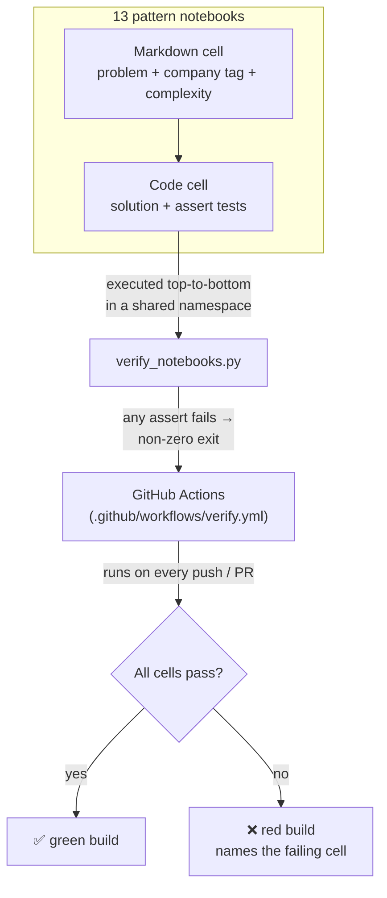

# Core Algorithms for LeetCode

**A pattern-first coding-interview prep bank: 13 algorithm patterns, ~90 worked problems each, every solution paired with runnable `assert` tests and enforced green by CI.**

[](https://github.com/shiva-shivanibokka/Core-algorithms-for-Leetcode/actions/workflows/verify.yml)
[](LICENSE)
[](https://www.python.org/)


---

### Recruiter TL;DR

- **What it is** — a self-built coding-interview study bank organized by *pattern* (Two Pointers, Sliding Window, DP, …) rather than by random problem, with ~1,170 solved problems, each tagged with the companies known to ask it and labelled Easy / Medium / Hard.
- **Hardest problem solved** — making the whole thing *trustworthy*: every solution carries inline `assert` tests, and a `verify_notebooks.py` harness executes all ~1,170 cells and fails on any wrong answer. Building it caught 41 latent bugs that a normal "looks fine" read had missed.
- **Impact** — 13 patterns × ~90 problems, all company-tagged and difficulty-tiered, **100% of cells passing under CI** on every push.

---

## Overview

Most interview prep is a pile of unrelated solved problems. This repo is organized the way the problems are actually *tested* — by the underlying pattern. Learn the shape of "Two Pointers" once, then drill ~90 variations of it, from a warm-up Easy through a Hard that a FAANG onsite would use.

Each of the 13 notebooks is a self-contained lesson: a short explanation of the pattern, then a graded ladder of problems. Every problem states which companies ask it, what difficulty it is, the approach, and its time/space complexity — followed by a clean solution and `assert`-based tests that prove the solution is correct.

**Who it's for:** primarily my own interview preparation, and anyone who wants a pattern-organized, *verified* problem bank to study from rather than trusting unverified snippets off the internet.

## What's inside

The 13 patterns, in the intended learning order:

| # | Pattern | # | Pattern |
|---|---------|---|---------|
| 01 | Two Pointers | 08 | Binary Tree BFS |
| 02 | Sliding Window | 09 | Graph DFS / BFS |
| 03 | Fast & Slow Pointers | 10 | Topological Sort |
| 04 | Binary Search | 11 | Top-K Elements (Heaps) |
| 05 | Merge Intervals | 12 | Subsets / Backtracking |
| 06 | Linked List Reversal (in-place) | 13 | Dynamic Programming |
| 07 | Binary Tree DFS | | |

### Anatomy of every problem

Each problem is a markdown cell (statement) followed by a code cell (solution + tests):

```
## Easy 1 — Two Sum II (LeetCode 167)
> 🏢 Asked by: Amazon, Microsoft, Google, Apple
Given a 1-indexed sorted array, find two numbers that add up to a target...
```

```python
def twoSumII(numbers, target):
    left, right = 0, len(numbers) - 1
    while left < right:
        s = numbers[left] + numbers[right]
        if s == target:
            return [left + 1, right + 1]   # 1-indexed
        elif s < target:
            left += 1
        else:
            right -= 1

assert twoSumII([2, 7, 11, 15], 9) == [1, 2]
assert twoSumII([2, 3, 4], 6) == [1, 3]
print("All tests passed!")
```

The `assert`s are the point: a solution isn't "done" until it proves itself.

## Architecture

This is a study repo, not a deployed service — so its "architecture" is how correctness is guaranteed. The design decision worth calling out: **notebooks give you prose + runnable code + tests in one place, but notebooks are notorious for silently rotting** (a cell edited and never re-run). The `verify_notebooks.py` harness plus CI exist specifically to close that gap.



**Why a shared namespace?** Cells build on earlier ones (helper functions like `make_list`, `build_tree`, shared `TreeNode`/`ListNode` classes), so the verifier executes each notebook top-to-bottom exactly as a human would run it — a per-cell sandbox would report false failures on every cell that reuses a helper.

## Tech Stack

- **Python 3.12** — solutions use the **standard library only** (`heapq`, `bisect`, `collections`); no third-party packages, so there's nothing to install and nothing to break.
- **Jupyter Notebooks** — chosen so explanation, solution, and tests live together in one readable artifact.
- **GitHub Actions** — CI that runs the full verification on every push.

## Skills Demonstrated

- **Data structures & algorithms** — 13 core patterns across arrays, strings, linked lists, trees, graphs, heaps, backtracking, and dynamic programming.
- **Algorithm design & complexity analysis** — every solution annotated with its time/space trade-off and the reasoning behind the approach.
- **Test-driven verification & automated testing** — every solution ships with `assert` cases; correctness is executable, not assumed.
- **CI/CD pipeline implementation** — GitHub Actions runs the whole suite on each push and blocks a red build.
- **System design & architecture reasoning** — a purpose-built verification harness with a documented design trade-off (shared-namespace execution) that models how the notebooks are actually run.

## Getting Started

No dependencies to install — Python 3.9+ and the standard library are all you need.

```bash
git clone https://github.com/shiva-shivanibokka/Core-algorithms-for-Leetcode.git
cd Core-algorithms-for-Leetcode

# Study interactively:
jupyter notebook            # then open any NN_Pattern.ipynb

# Or verify every solution in one shot (no Jupyter needed):
python verify_notebooks.py
```

Expected output when everything is correct:

```
All notebooks pass.
```

## Usage

**Study a pattern:** open a notebook (e.g. `04_Binary_Search.ipynb`) and read top to bottom — each problem escalates in difficulty. Run a cell (`Shift+Enter`); a passing solution prints `All tests passed!`.

**Verify everything before committing:** run the harness. If a cell is wrong, it names the notebook, the cell number, and the error:

```bash
$ python verify_notebooks.py
FAIL  11_Top_K_Elements.ipynb  cell 85: IndexError: list index out of range
        -> import heapq
1 failing cell(s).
```

This is the same check CI runs, so a green local run means a green build.

## Project Structure

```
.
├── 01_Two_Pointers.ipynb          # ┐
├── 02_Sliding_Window.ipynb        # │
├── ...                            # │  13 pattern notebooks, each ~90 graded,
├── 13_Dynamic_Programming.ipynb   # ┘  company-tagged problems + inline tests
├── verify_notebooks.py            # runs every cell, exits non-zero on any failure
├── verify_tags.js                 # dev utility: counts company-tagged problems
├── inspect_headings.js            # dev utility: inspects notebook headings
├── .github/workflows/verify.yml   # CI: run verify_notebooks.py on every push
├── LICENSE
└── README.md
```

## Testing

Testing is not a separate suite — it's built into every problem. Each solution cell ends with `assert` statements covering the core case plus edge cases (empty input, single element, negatives, etc.).

`verify_notebooks.py` is the test runner: it executes all ~1,170 cells across the 13 notebooks and exits non-zero if any assertion fails. **All cells currently pass**, and CI enforces that state on every push and pull request.

> This harness was written after an audit found **41 cells whose asserts didn't actually hold** — the notebooks had never been run end-to-end. Fixing those (5 genuine solution bugs, ~36 incorrect expected values) and adding the harness is what makes the "all green" claim above trustworthy rather than aspirational.

## Impact / Results

All figures below are structural counts, directly verifiable from the repo:

- **13** algorithm patterns, in a deliberate learning order.
- **~90** problems per pattern (**~1,170** total), each tagged with the companies that ask it and labelled Easy / Medium / Hard.
- **100%** of solution cells pass `verify_notebooks.py`, enforced by CI on every push.
- **0** third-party dependencies — pure standard library.

## Roadmap

- **Spaced-repetition tracking** — a lightweight workflow to schedule which solved problems to re-attempt and when, so review effort concentrates on the problems most likely to be forgotten.
- Additional patterns as needed (e.g. Union-Find, Trie, Monotonic Stack, Bit Manipulation).

*(CI is already implemented — see `.github/workflows/verify.yml`.)*

## License

Released under the [MIT License](LICENSE).
